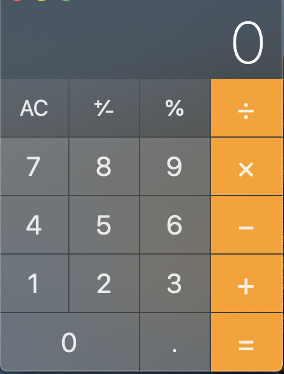
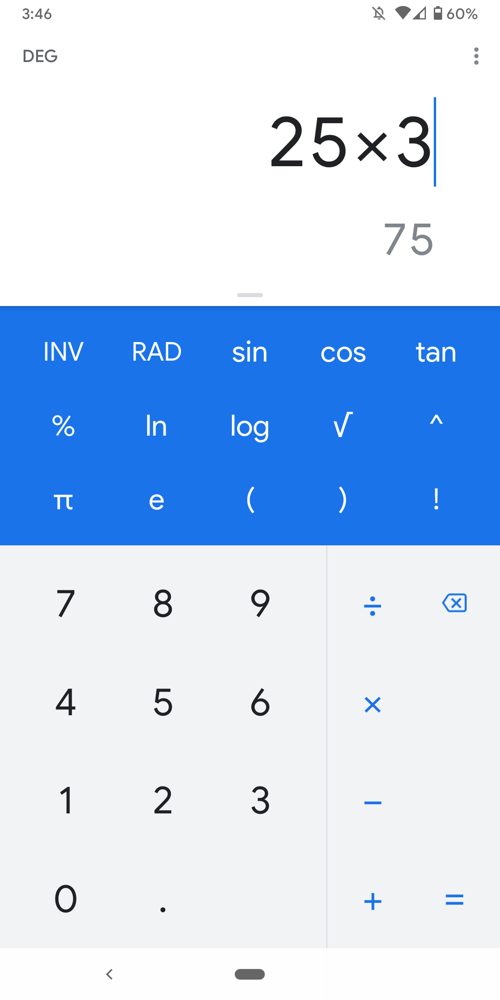
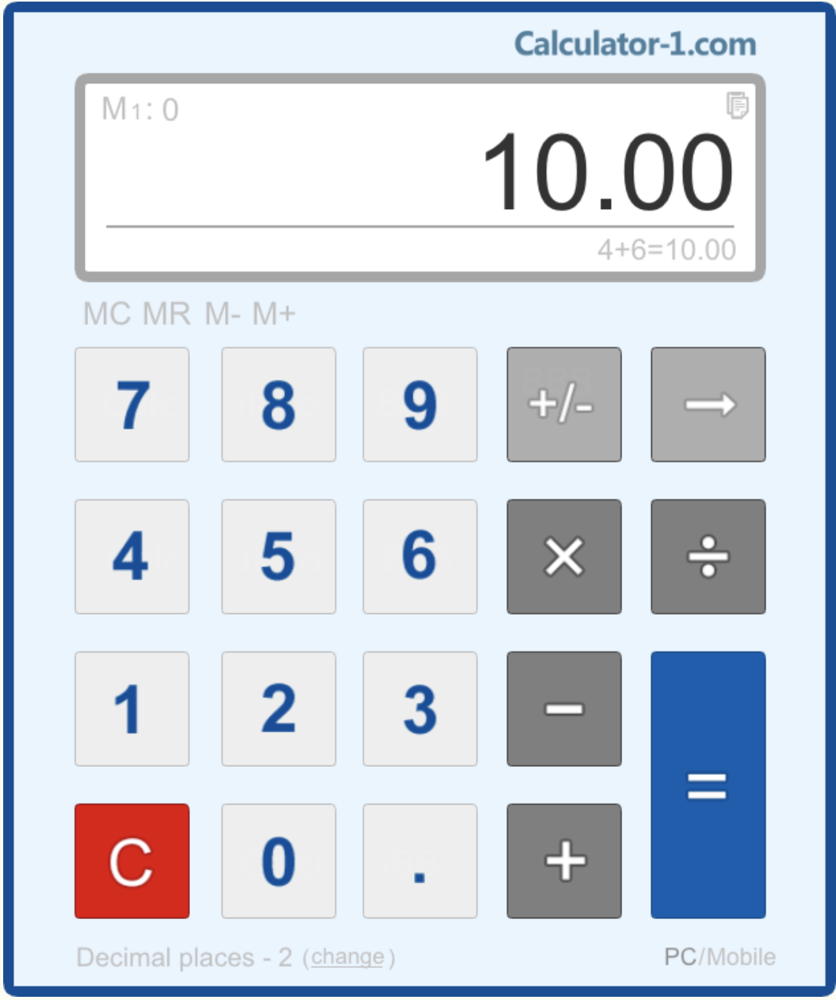
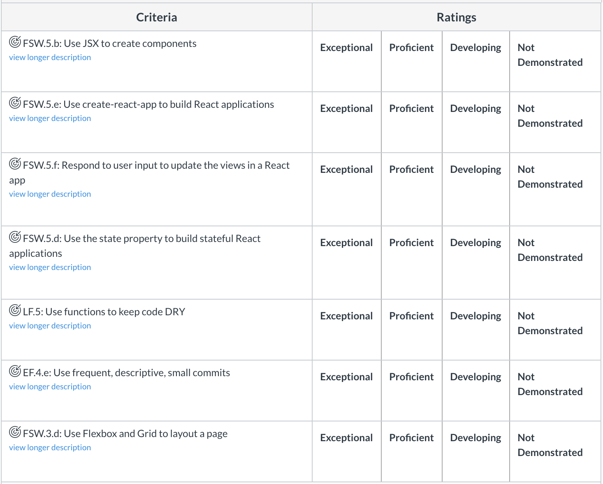

# Pursuit-Core-Web-React-Calculator-Lab

## Overview

- You will create a React app that mimics a simple calculator
- Please use `create-react-app` to generate your project
- Break your application down to necessary components

## UI

Feel free to make the design your own.  Here are some real calculator UIs that you can use for inspiration.

## Functionality

You must implement all features in the MVP list.  After those are completed, look at and implement as many of the stretch features as you want to.

### MVP

Ensure that your app has each of the following:

- Buttons 0-9 that can be used to input numbers
- Addition button
- Subtraction button
- Multiplication button
- Division button that support integer division
- Equals button that executes the current operation
- Clear button that resets everything
- ± button that toggles between negative and positive numbers
- Add commas appropriately in numbers (e.g turn "1000" into "1,000")

### Stretch Features

- `.` button that adds a decimal point to the current number
- `%` button that converts the current value into a percentage
- Support large and small numbers with [scientific notation](https://en.wikipedia.org/wiki/Scientific_notation#E_notation)
- Change the clear button to toggle between:
    - AC Clears all of the data in the screen
    - C: Clears only what is being displayed
- Chain together multiple operands
    - ex:  5 + 5 + 5
- Chain together multiple equals sign button pushes
    - ex: `5` `+` `5` `=` `=` `=` should display `20`
- `()` buttons to support order of operations
- Support exponentiation and square roots
- Support geometric operations

Helpful Libraries for Decimals:
- [decimal.js](https://mikemcl.github.io/decimal.js/)
- [math.js](https://mathjs.org/)

## State

State will be an important component of your application.  It may be helpful to think about incorporating the following elements into your state:

- displayValue (What the screen currently displays)
- previousValue (What value the user selected before pressing an operation button)
- operation (What operation the user is performing (+/-/÷/x))

## Rubric

