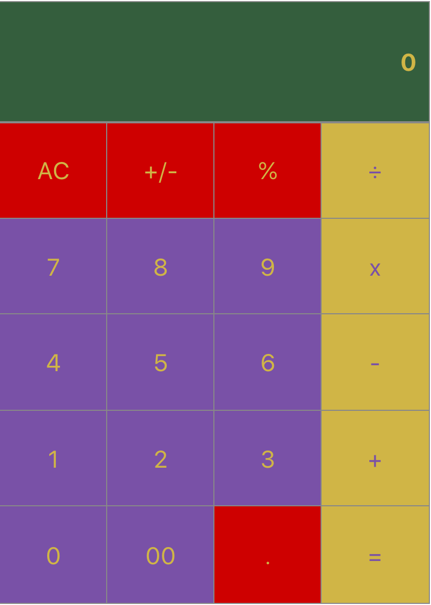

# React Calculator

## Overview
A simple calculator built with React to emulate the functionality of a typical smartphone calculator.

## UI

My UI was inspired by the iOS portrait calculator with some color choices chosen by my little cousin 😊.

## Functionality

- Buttons 0-9 that can be used to input numbers
- Addition button
- Subtraction button
- Multiplication button
- Division button that support integer division
- Equals button that executes the current operation
- ± button that toggles between negative and positive numbers
- `.` button that adds a decimal point to the current number
- `%` button that converts the current value into a percentage
- Clear button to toggle between:
    - AC Clears all of the data in the screen
    - C: Clears only what is being displayed
- Chain together multiple operands
    - ex:  5 + 5 + 5
- Chain together multiple equals sign button pushes
    - ex: `5` `+` `5` `=` `=` `=` should display `20`
    
## Demo

